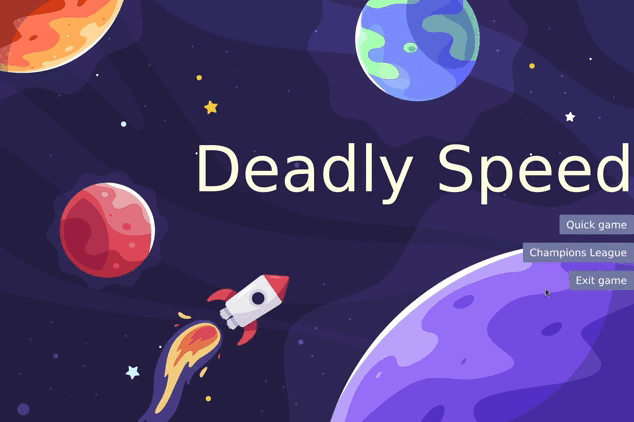

# <b>Deadly Speed</b>
### <samp>Hello!, thank you for watching this little project</samp> :hot_face:

This is a game of confrontation and strategy because when attacking you must also think if you can escape.

I have tried to make the code understandable so that you can build more game modes. 

So I challenge you to build a new mode with a new game logic. Just make sure your classes comply with the contract of the created interfaces. :hammer_and_pick:

## :eyes: <samp>Two game modes</samp>

| <b>Quick Game</b>                                                                                     |
|-------------------------------------------------------------------------------------------------------|
| <a href="#--------"></a>               |


| <b>Champions League Game</b>                                                                          |
|-------------------------------------------------------------------------------------------------------|
| <a href="#--------"></a>   |


## :wrench: <samp>Test the game</samp>

The game is not on the internet but you can try it on your own operating system. With theses setups are will enable the Quick Game.

<br>
<b>1. Install Required Dependencies</b>

Assuming that your OS is Arch Linux :skull:

> Install [Maven](https://maven.apache.org/)


```sh
sudo pacman -S mariadb maven
```

:warning: Install MariaDB if you want to play **Champions League**. After configuring mariadb, access your mariadb database with the root user and run the following script [`src/main/resources/sql/setup_database.sql`](https://github.com/jorghee/Deadly-Speed/blob/main/src/main/resources/sql/setup_database.sql). Finally, create the following tables into your **fp2_23b** database [`src/main/resources/sql/tables.sql`](https://github.com/jorghee/Deadly-Speed/blob/main/src/main/resources/sql/tables.sql)

<br>
<b>2. Install Deadly Speed</b>

> Clone this repository

```sh
git clone https://github.com/jorghee/Deadly-Speed.git
cd Deadly-Speed
```

> Use Maven to manager the dependencies

:warning: You must modify the [`pom.xml`](https://github.com/jorghee/Deadly-Speed/blob/main/pom.xml) file to compile the project with the specific or minor version of Java installed on your operating system. 

```xml
<maven.compiler.source>17</maven.compiler.source>
<maven.compiler.target>17</maven.compiler.target>
```
The minimun version required to this project is java 17

> Compile and run with Maven's javafx-maven-plugin plugin
```sh
mvn javafx:run
```
Maybe you need you need to set the environment variable `JAVA_HOME` to the path of your JDK installation.
> Find the path of your JDK installation
```sh
readlink -f $(which java) | sed "s:bin/java::"
```
The output of the previous command is the path of your JDK installation.
> Set the environment variable, generally in the `.bashrc` or `.zshrc` file
```sh
export JAVA_HOME=/usr/lib/jvm/java-17-openjdk
source ~/.bashrc
```
